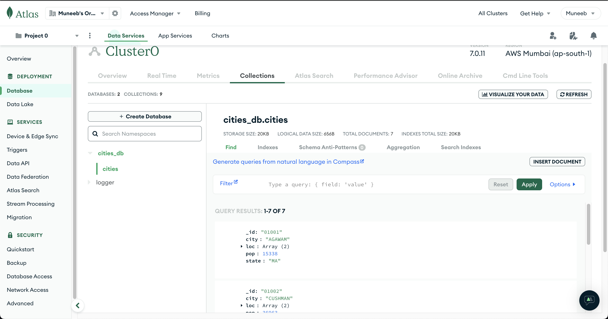
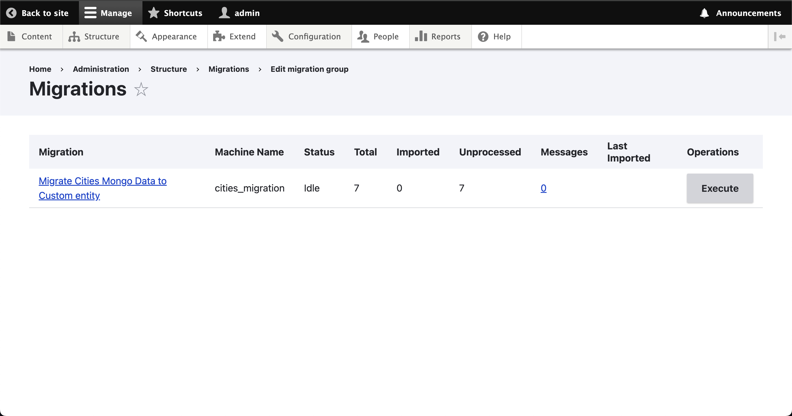

Pre requisites
==============
`migrate_plus` and `migrate_tools` modules

Migrations
==========
Install the module: `drush en mongo_migration`

Export the migration: `drush cex -y`

Run the migration: `drush mim cities_migration`

Mongo DB
========
1. Install the php-mongoldb extension and add to the php.ini. As I was using ddev for development I had to do it via Dockerfile.
2. I used `mongoDB atlas` online tool to import and configure the data. The connection string is Given in the settings file.
3. Add the settings to db connection in ddev.settings.php
4. Install the supported module for mongodb.

Screenshots of the implementation is available in the `screenshots` folder.

The skeleton of the module is generated via drush (module, entity). So there will be some unwanted code (for eg: templates, .module file). please ignore that.

